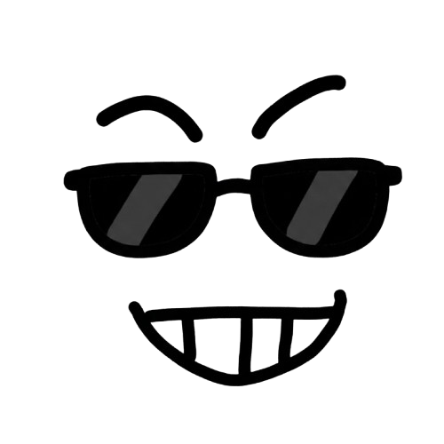

+++
title = 'About'
date = '2025-12-15T23:01:59+11:00'
aliases = [ "about-me", "about-muyang1337", "contact" ]
license = false
comments = false
[menu.main]
weight = -90
[menu.main.params]
icon = "user"
+++

# About Me

My name is Muyang. After years of hard work, I finally landed a job as an offensive security engineer in Sydney and officially began my hacking journey.

I’ve always been deeply drawn to what people often call the hacking spirit — curiosity, persistence, and the desire to truly understand how things work. That curiosity is what pulled me into the world of cybersecurity in the first place.

There are a few hacker dreams I hope to achieve before retiring:

- Find high-quality CVEs

- Make it to the DEFCON CTF finals

- Give a talk at DEFCON

- Build a solid reputation in the bug bounty community

I’ve seen many incredibly talented hackers who have already reached these milestones. I don’t consider myself as smart as them — but I believe I can try harder, and stay curious longer.

This blog mainly serves as my personal technical notebook: a place to capture thoughts, experiments, and observations over time. Much of the writing will focus on security-related topics, but there’s no strict commitment — if something is interesting enough, it may end up here.

The views and opinions expressed on this blog are my own and do not represent those of my employer.

