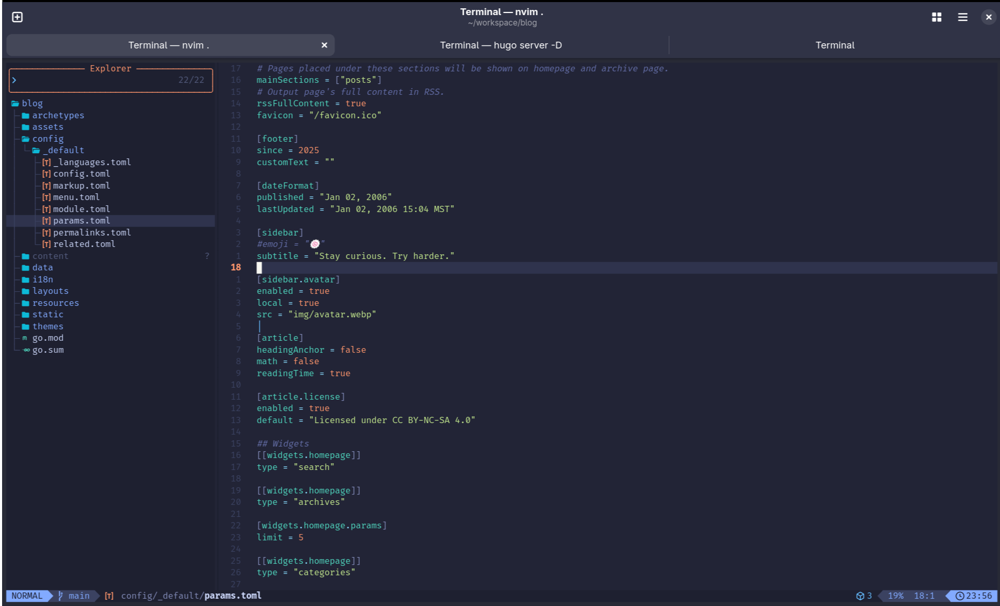
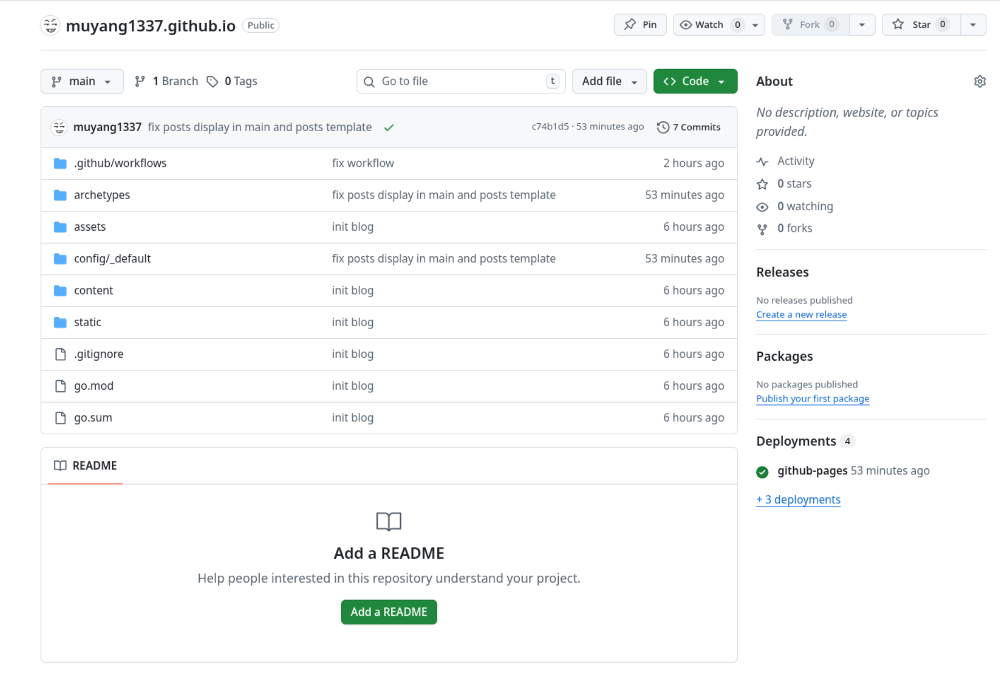
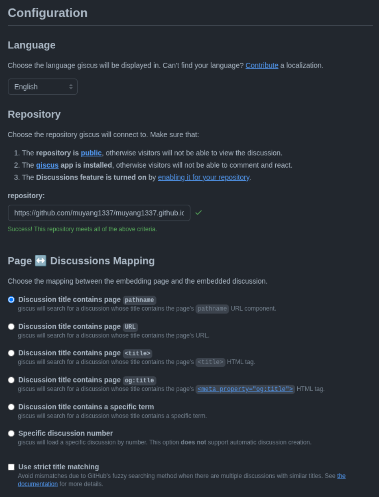
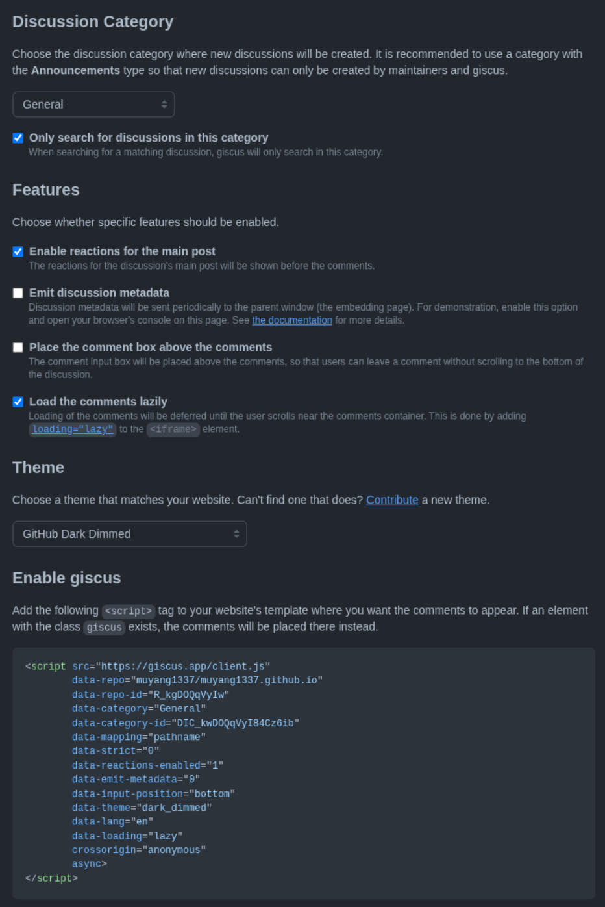
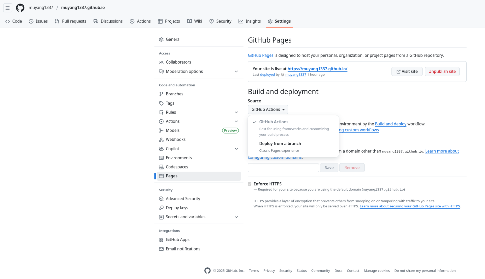

+++
title = 'My Blog Setup: Hugo + Stack + Github Pages'
author = 'muyang1337'
date = '2025-12-17T23:21:56+11:00'
description = 'Years ago I played with hugo a bit, however things have changed quite a lot. Here is a post recording how I created this blog step by step using Hugo + Stack + Github Pages'
tags = ["Hugo", "Blog", "Github Pages", "Stack Theme"]
categories = ["Notes"]
image = "cover.svg"
+++

## Initialise Local Blog Folder
1. Install [hugo](https://gohugo.io/installation/)
2. Create your local blog folder with basic toml setup. `hugo new site blog --format toml`
3. Initialise the git for the blog. `cd blog && git config --global init.defaultBranch main && git init` 
4. Install the theme [Stack](https://stack.jimmycai.com/guide/getting-started#hugo-module) using Hugo module.
5. Delete the default `hugo.toml` under `blog` folder and download these [toml files](https://github.com/CaiJimmy/hugo-theme-stack-starter/tree/master/config/_default) to local `blog/config/_default/`
6. Configure the downloaded files according to own preference.



## Connect to the Github

1. Create a repo named `{github-username}.github.io` with `public` visibility.
2. Set remote origin `git remote add origin git@github.com:{github-username}/{github-username}.github.io.git`
3. Push the local blog to remote github `git push -u origin main`



## Comment Configuration

[giscus](https://giscus.app/) seems to be the go to option. It makes use of Github Discussion API. Hence this step has to be after Step #2.

Basically follow [giscus.app](https://giscus.app/) and you should be good to go.

In the `blog/config/_default/params.toml` We can see the config fields are

```toml
[comments]
enabled = true
provider = "giscus"

[comments.giscus]
repo = ""
repoID = ""
category = ""
categoryID = ""
mapping = ""
lightTheme = ""
darkTheme = ""
reactionsEnabled = 1
emitMetadata = 0
```

By completing the prerequisites and filling the form on [giscus.app](https://giscus.app), it will generate a javascript tag together with all the information needed to fill the local config file for the comment part.

   

After filling the form, we can see that information bundle wrapped by a `<script>` tag

```javascript
<script src="https://giscus.app/client.js"
        data-repo="muyang1337/muyang1337.github.io"
        data-repo-id="R_kgDOQqVyIw"
        data-category="General"
        data-category-id="DIC_kwDOQqVyI84Cz6ib"
        data-mapping="pathname"
        data-strict="0"
        data-reactions-enabled="1"
        data-emit-metadata="0"
        data-input-position="bottom"
        data-theme="dark_dimmed"
        data-lang="en"
        data-loading="lazy"
        crossorigin="anonymous"
        async>
</script>
```

Fill the fields in the configuration file.

```toml
[comments]
enabled = true
provider = "giscus"

[comments.giscus]
repo = "muyang1337/muyang1337.github.io"
repoID = "R_kgDOQqVyIw"
category = "General"
categoryID = "DIC_kwDOQqVyI84Cz6ib"
mapping = "pathname"
lightTheme = "light_tritanopia"
darkTheme = "dark_dimmed"
reactionsEnabled = 1
emitMetadata = 0
```

## Build and Deploy

1. Change the source from `Deploy from a branch` to `GitHub Actions`



2. Append image cache field to config file `blog/config/_default/config.toml`
   ```toml
   [caches]
   [caches.images]
   dir = ':cacheDir/images'
   ```
3. Create GitHub Actions workflow `mkdir -p .github/workflows && touch .github/workflows/deploy.yaml`
   ```yaml
   name: Build and deploy
   on:
     push:
       branches:
         - main
     workflow_dispatch:
   permissions:
     contents: read
     pages: write
     id-token: write
   concurrency:
     group: pages
     cancel-in-progress: false
   defaults:
     run:
       shell: bash
   jobs:
     build:
       runs-on: ubuntu-latest
       env:
         DART_SASS_VERSION: 1.96.0
         GO_VERSION: 1.25.5
         HUGO_VERSION: 0.152.2
         NODE_VERSION: 24.12.0
         TZ: Europe/Oslo
       steps:
         - name: Checkout
           uses: actions/checkout@v5
           with:
             submodules: recursive
             fetch-depth: 0
         - name: Setup Go
           uses: actions/setup-go@v5
           with:
             go-version: ${{ env.GO_VERSION }}
             cache: false
         - name: Setup Node.js
           uses: actions/setup-node@v4
           with:
             node-version: ${{ env.NODE_VERSION }}
         - name: Setup Pages
           id: pages
           uses: actions/configure-pages@v5
         - name: Create directory for user-specific executable files
           run: |
             mkdir -p "${HOME}/.local"
         - name: Install Dart Sass
           run: |
             curl -sLJO "https://github.com/sass/dart-sass/releases/download/${DART_SASS_VERSION}/dart-sass-${DART_SASS_VERSION}-linux-x64.tar.gz"
             tar -C "${HOME}/.local" -xf "dart-sass-${DART_SASS_VERSION}-linux-x64.tar.gz"
             rm "dart-sass-${DART_SASS_VERSION}-linux-x64.tar.gz"
             echo "${HOME}/.local/dart-sass" >> "${GITHUB_PATH}"
         - name: Install Hugo
           run: |
             curl -sLJO "https://github.com/gohugoio/hugo/releases/download/v${HUGO_VERSION}/hugo_extended_${HUGO_VERSION}_linux-amd64.tar.gz"
             mkdir "${HOME}/.local/hugo"
             tar -C "${HOME}/.local/hugo" -xf "hugo_extended_${HUGO_VERSION}_linux-amd64.tar.gz"
             rm "hugo_extended_${HUGO_VERSION}_linux-amd64.tar.gz"
             echo "${HOME}/.local/hugo" >> "${GITHUB_PATH}"
         - name: Verify installations
           run: |
             echo "Dart Sass: $(sass --version)"
             echo "Go: $(go version)"
             echo "Hugo: $(hugo version)"
             echo "Node.js: $(node --version)"
         - name: Install Node.js dependencies
           run: |
             [[ -f package-lock.json || -f npm-shrinkwrap.json ]] && npm ci || true
         - name: Configure Git
           run: |
             git config core.quotepath false
         - name: Cache restore
           id: cache-restore
           uses: actions/cache/restore@v4
           with:
             path: ${{ runner.temp }}/hugo_cache
             key: hugo-${{ github.run_id }}
             restore-keys:
               hugo-
         - name: Build the site
           run: |
             hugo \
               --gc \
               --minify \
               --baseURL "${{ steps.pages.outputs.base_url }}/" \
               --cacheDir "${{ runner.temp }}/hugo_cache"
         - name: Cache save
           id: cache-save
           uses: actions/cache/save@v4
           with:
             path: ${{ runner.temp }}/hugo_cache
             key: ${{ steps.cache-restore.outputs.cache-primary-key }}
         - name: Upload artifact
           uses: actions/upload-pages-artifact@v3
           with:
             path: ./public
     deploy:
       environment:
         name: github-pages
         url: ${{ steps.deployment.outputs.page_url }}
       runs-on: ubuntu-latest
       needs: build
       steps:
         - name: Deploy to GitHub Pages
           id: deployment
           uses: actions/deploy-pages@v4
   ```

4. Commit and push to origin `git add . && git commit -m "add workflows" && git push -u origin main`

I encountered an issue when GitHub Actions attempting to build.

```bash
Run hugo \
go: downloading go1.25.5 (linux/amd64)
hugo: downloading modules …
hugo: collected modules in 5746 ms
Start building sites … 
hugo v0.128.0-e6d2712ee062321dc2fc49e963597dd5a6157660+extended linux/amd64 BuildDate=2024-06-25T16:15:48Z VendorInfo=gohugoio

ERROR render of "taxonomy" failed: "/home/runner/work/_temp/hugo_cache/modules/filecache/modules/pkg/mod/github.com/!cai!jimmy/hugo-theme-stack/v3@v3.32.0/layouts/_default/baseof.html:4:12": execute of template failed: template: _default/list.html:4:12: executing "_default/list.html" at <partial "head/head.html" .>: error calling partial: "/home/runner/work/_temp/hugo_cache/modules/filecache/modules/pkg/mod/github.com/!cai!jimmy/hugo-theme-stack/v3@v3.32.0/layouts/partials/head/head.html:25:4": execute of template failed: template: partials/head/head.html:25:4: executing "partials/head/head.html" at <partial "google_analytics.html" .>: error calling partial: partial "google_analytics.html" not found
ERROR render of "section" failed: "/home/runner/work/_temp/hugo_cache/modules/filecache/modules/pkg/mod/github.com/!cai!jimmy/hugo-theme-stack/v3@v3.32.0/layouts/_default/baseof.html:4:12": execute of template failed: template: _default/list.html:4:12: executing "_default/list.html" at <partial "head/head.html" .>: error calling partial: "/home/runner/work/_temp/hugo_cache/modules/filecache/modules/pkg/mod/github.com/!cai!jimmy/hugo-theme-stack/v3@v3.32.0/layouts/partials/head/head.html:25:4": execute of template failed: template: partials/head/head.html:25:4: executing "partials/head/head.html" at <partial "google_analytics.html" .>: error calling partial: partial "google_analytics.html" not found
ERROR render of "home" failed: "/home/runner/work/_temp/hugo_cache/modules/filecache/modules/pkg/mod/github.com/!cai!jimmy/hugo-theme-stack/v3@v3.32.0/layouts/_default/baseof.html:4:12": execute of template failed: template: index.html:4:12: executing "index.html" at <partial "head/head.html" .>: error calling partial: "/home/runner/work/_temp/hugo_cache/modules/filecache/modules/pkg/mod/github.com/!cai!jimmy/hugo-theme-stack/v3@v3.32.0/layouts/partials/head/head.html:25:4": execute of template failed: template: partials/head/head.html:25:4: executing "partials/head/head.html" at <partial "google_analytics.html" .>: error calling partial: partial "google_analytics.html" not found
ERROR render of "page" failed: "/home/runner/work/_temp/hugo_cache/modules/filecache/modules/pkg/mod/github.com/!cai!jimmy/hugo-theme-stack/v3@v3.32.0/layouts/_default/baseof.html:4:12": execute of template failed: template: _default/archives.html:4:12: executing "_default/archives.html" at <partial "head/head.html" .>: error calling partial: "/home/runner/work/_temp/hugo_cache/modules/filecache/modules/pkg/mod/github.com/!cai!jimmy/hugo-theme-stack/v3@v3.32.0/layouts/partials/head/head.html:25:4": execute of template failed: template: partials/head/head.html:25:4: executing "partials/head/head.html" at <partial "google_analytics.html" .>: error calling partial: partial "google_analytics.html" not found
Total in 5889 ms
Error: error building site: render: failed to render pages: render of "404" failed: "/home/runner/work/_temp/hugo_cache/modules/filecache/modules/pkg/mod/github.com/!cai!jimmy/hugo-theme-stack/v3@v3.32.0/layouts/_default/baseof.html:4:12": execute of template failed: template: 404.html:4:12: executing "404.html" at <partial "head/head.html" .>: error calling partial: "/home/runner/work/_temp/hugo_cache/modules/filecache/modules/pkg/mod/github.com/!cai!jimmy/hugo-theme-stack/v3@v3.32.0/layouts/partials/head/head.html:25:4": execute of template failed: template: partials/head/head.html:25:4: executing "partials/head/head.html" at <partial "google_analytics.html" .>: error calling partial: partial "google_analytics.html" not found
Error: Process completed with exit code 1.
```

This is because I used the Hugo GitHub Actions workflow script on the GitHub market, which was using 
```
    env:
      HUGO_VERSION: 0.128.0
```

That can be solved using the latest hugo version(`v0.152.2` in this case), or simply using the workflow mentioned above.


## The End

When I first attempted to implement Hugo blog a couple of years ago, I remembered the best practice was to create a private blog repo, and use GitHub Actions to compile and deploy it to the `{github-username}.github.io` with some tedious PAT set up. Seems it's not recommended anymore. For the future improvement I think it would be `giscus` comment style. Current `giscus` comment does not match `Stack theme` well. `giscus` provides a way to customize CSS to make it look even better. That will be another post, if there is. 

Reference: 
- [Hugo Quick Start](https://gohugo.io/getting-started/)
- [Hugo GitHub Pages Host](https://gohugo.io/host-and-deploy/host-on-github-pages/)
- [Stack theme docs](https://stack.jimmycai.com/guide/)

